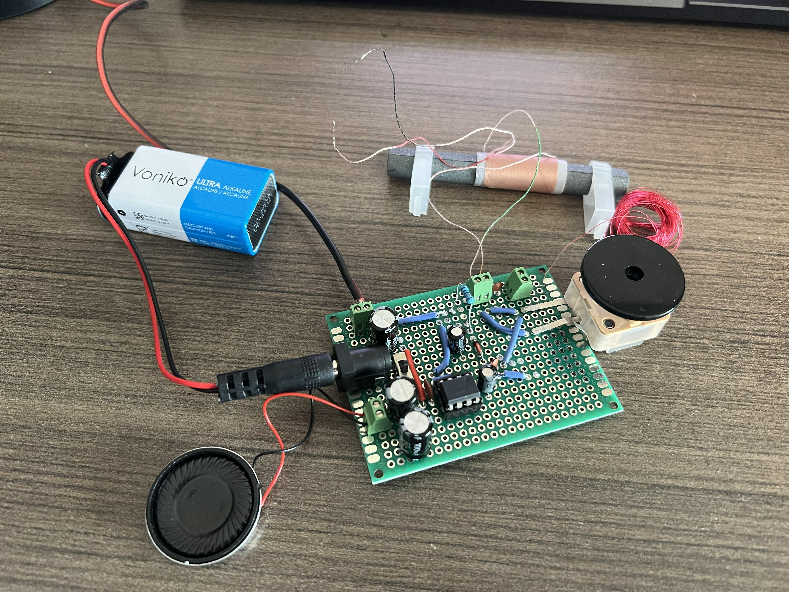
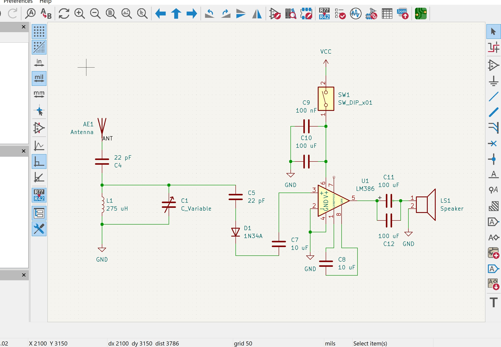

# AM Radio Receiver

A tunable AM radio receiver built using analog electronics principles including LC resonance, envelope detection, and audio amplification.

  

[AM Radio Demo Video](https://youtu.be/ojHJdK3EBfc)

## How it Works

The ferrite rod antenna coil and variable capacitor form a parallel LC resonant circuit:

$$
f = \frac{1}{2\pi\sqrt{LC}}
$$

By adjusting the capacitance, the resonant frequency changes, allowing the receiver to tune to different AM radio stations.

AM radio stations transmit a high-frequency carrier whose amplitude is modulated by an audio signal. A germanium diode rectifies the RF waveform, extracting the audio envelope.

The recovered audio signal is amplified by an LM386 audio amplifier to drive an 8-ohm speaker.

Here is the KiCAD schematic (also available for download in this repository): 

  

### Main Components

| Component               | Description                                   |
| ----------------------- | --------------------------------------------- |
| Ferrite Rod Antenna     | RF signal pickup and inductive tuning element |
| Variable Capacitor      | Frequency tuning                              |
| 1N34A Germanium Diode   | Envelope detector                             |
| LM386                   | Audio power amplifier                         |
| 8Ω Speaker              | Audio output                                  |
| Electrolytic Capacitors | Coupling and power filtering                  |
| Ceramic Capacitors      | RF filtering and tuning                       |

## Main Challenges

* Achieving stable LC resonance in the AM broadcast band
* Managing RF grounding and signal integrity
* Debugging analog signal paths without oscilloscope access
* Proper antenna and detector coupling

## Engineering Focus Areas

* Analog circuit design
* Resonant circuit analysis
* Signal demodulation
* Analog audio amplification
* KiCAD schematic design
* Hardware debugging and prototyping

## Future Improvements

* Custom PCB design
* Improved selectivity and filtering
